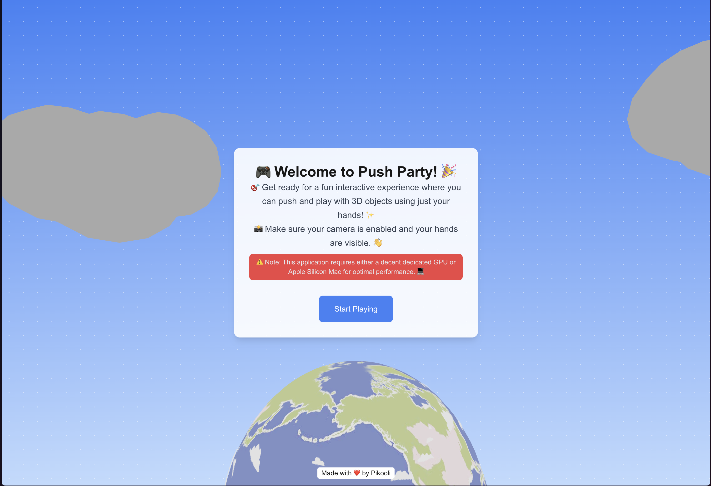

# Push Party

A fun interactive web game that uses hand tracking to let you push and interact with 3D objects in a virtual space.

## Features

- Real-time hand tracking using MediaPipe
- 3D graphics and physics with Three.js, React Three Fiber, and Rapier
- Interactive objects that respond to hand movements
- Customizable textures

## Getting Started

```bash
npm install
npm run dev
```

⚠️ Note: This application requires either a decent dedicated GPU or
Apple Silicon Mac for optimal performance. 💻


